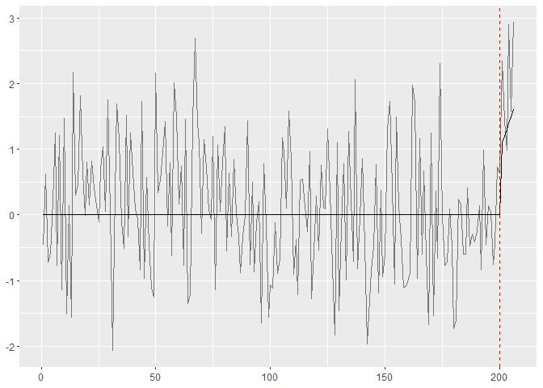

<!-- README.md is generated from README.Rmd. Please edit that file -->

# FLOC : Fast Limited-memory Optimal Change detector

<!-- badges: start -->

<!-- badges: end -->

The goal of FLOC is to sequentially detect a change in a piecewise
linear model. The package also provides a method to tune the threshold
of the algorithm to bound the type I error, a function to estimate the
false alarm probability and a function to estimate the expected
detection delay.

## Installation

You can install the development version of FLOC like so:

``` r
install.packages("devtools")
devtools::install_github("AnnikaHueselitz/FLOC")
```

## Example

This is a basic example which shows you how to solve a common problem:

For this example we want to let the algorithm run with bins that are 5
data points wide.

First we want to tune the type I error such that with 500 historical
observations available the probability to get a false alarm in the first
500 data points is approximately 0.5.

``` r
#load package
library(FLOC)

#set seed for reproducibility
set.seed(1)

#bin size for a jump and a kink
NJ <- 5
NK <- 10

#amount of historical data
k <- 500

#the algorithm should have a false alarm in tau data points with a probability of eta
eta <- 0.5
tau <- 500 

#number of data sets to draw, the threshold tuning gets exacter when this is higher, but the computation is then slower
r <- 1000

#tuning of the threshold
rho <- t_tuning(NJ, NK, tau, k, eta, r)
```

Next we want to simulate some data to test the algorithm on:

``` r
#set seed for reproducibility
set.seed(2)

#true changepoint
tau_0 <- 200

#intercept at change point before change
alpha_minus <- 0

#slope before change
beta_minus <- 0

#intercept at change point after change
alpha_plus <- 1

#slope after change
beta_plus <- 0.1

#generating historical data
hist_data <- rnorm(k) + seg_lin_fun((1 - k):0, tau_0, alpha_minus, beta_minus, alpha_plus, beta_plus)

#initalize the detector
detector <- FLOC_init(hist_data, NJ, NK, rho$both_jump, rho$both_kink)

#initialize time and vector to save data for plot
n <- 1
data <- c()

#generate new data as long as no detection was made and update the detector
while (!(detector$detect_jump||detector$detect_kink)) {
  
  #generate new data point
  new_data <- rnorm(1) + seg_lin_fun(n, tau_0, alpha_minus, beta_minus, alpha_plus, beta_plus)
  
  #save data to plot later
  data <- c(data, new_data)
  
  #update detector
  detector <- FLOC_iter(new_data, detector)
  
  n <- n+1
}

if (n <= tau_0) {
  print(paste("A detection was made at observation: ",n, "That is a false alarm"))
} else {
print(paste("A detection was made at observation: ",n, "That is a detection delay of: ", n - tau_0))
  if(detector$detect_jump && detector$detect_kink){
    print("Both detector made a detection simultaneously.")
  }
  else if(detector$detect_jump){
    print("The jump detector made the detection.")
  }
  else {
    print("The kink detector made the detection.")
  }
}
#> [1] "A detection was made at observation:  207 That is a detection delay of:  7"
#> [1] "The jump detector made the detection."
```

Plot the detection to visualize it:

``` r

plot_detection(data, tau_0, alpha_minus, beta_minus, alpha_plus, beta_plus)
```



Next we can check if the false alarm probability that we wanted to
achieve with the threshold tuning is reasonable, by estimating it:

``` r
est_faprob(NJ, NK, rho$both_jump, rho$both_kink, tau, k)
#> [1] 0.57
```

Next we can check estimate the expected detection delay for the above
example:

``` r
est_detdel(NJ, NK, rho$both_jump, rho$both_kink, k, 1, 0.01)
#> [1] 12
```

Last we can estimate the probability for each detector to detect the
change first in the above example:

``` r
est_dettype(NJ, NK, rho$both_jump, rho$both_kink, k, 1, 0.01)
#>   both  jump  kink
#> 1 0.42 0.455 0.125
```
